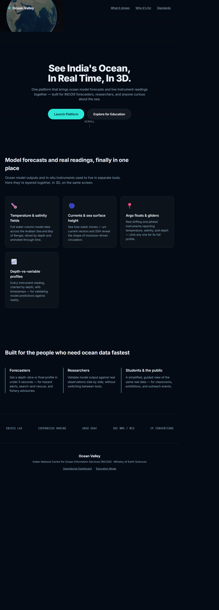
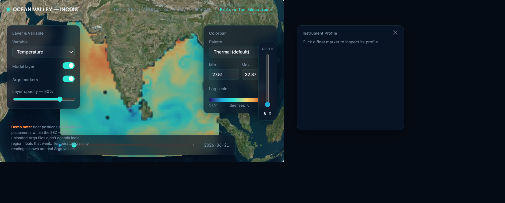
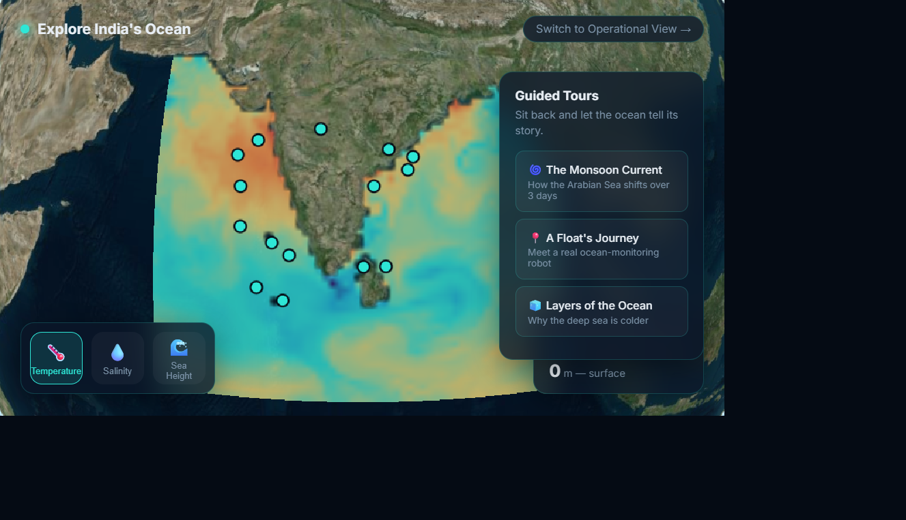

<div align="center">

# 🌊 Varunetra

### A 3D ocean intelligence platform for India's EEZ

[](https://python.org)
[](https://fastapi.tiangolo.com)
[](https://cesium.com/platform/cesiumjs/)
[](https://xarray.dev/)
[](.)

> **See India's ocean in context:** model forecasts, depth, time, and real instrument profiles brought together in one visual workspace.

</div>

---

## 📌 Table of Contents

- [What Is This?](#-what-is-this)
- [The Problem We Are Solving](#-the-problem-we-are-solving)
- [How It Works](#-how-it-works)
- [The Three User Experiences](#-the-three-user-experiences)
- [System Architecture](#-system-architecture)
- [Key Design Decisions](#-key-design-decisions)
- [Screenshots](#-screenshots)
- [Project Structure](#-project-structure)
- [Getting Started](#-getting-started)
- [Data and Scientific Basis](#-data-and-scientific-basis)
- [Tech Stack](#-tech-stack)
- [Prototype Status](#-prototype-status)
- [SIH Context](#-sih-context)

---

## 🔍 What Is This?

Ocean Valley is a browser-based 3D visualization platform for oceanographic
data over the Indian EEZ. It combines gridded ocean-model fields with Argo
instrument observations so a user can see both:

- **What the model predicts** across the Arabian Sea and Bay of Bengal.
- **What instruments observe** through depth-versus-variable profiles.

The same data engine supports two audiences. The operational dashboard gives
forecasters and researchers precise controls. The outreach mode turns the
same data into guided stories for students, exhibitions, and the public.

## 🚨 The Problem We Are Solving

Ocean data is valuable but difficult to interpret when it is split across
scientific files, data services, map viewers, and separate instrument tools.
This creates several practical problems:

| Challenge | Why It Matters |
|---|---|
| Model data is multidimensional | Temperature, salinity, currents, and sea height change by depth and time. |
| Forecasts and observations are separated | Users cannot quickly compare a model field with a measured profile. |
| Scientific tools are difficult for non-specialists | Students and the public need a visual explanation, not raw NetCDF files. |
| Ocean conditions change continuously | Time playback is useful for understanding circulation and monsoon-driven change. |
| Source data is heavy and inconsistent | A repeatable ingestion path is needed before data can reach a browser. |

Ocean Valley addresses this with a map-first interface, slice-based rendering,
clickable instrument profiles, guided tours, and a backend contract that can
later switch from local NetCDF to THREDDS/OPeNDAP without changing the UI.

## ⚙️ How It Works

The prototype follows a one-directional data pipeline:

```text
Raw NetCDF files
			│
			├──► Argo parser ──► QC-good instrument/profile rows ──► PostGIS
			│
			└──► Model parser ──► depth/time slice grids ──► FastAPI / frontend bundle
																												│
																												▼
																			Cesium globe + controls + profile charts
																												│
													┌─────────────────────────────┴─────────────────────────────┐
													▼                                                           ▼
								 Operational dashboard                                      Education mode
						 precise controls and inspection                          guided stories and simple controls
```

### Step-by-step flow

**1. 📦 Source data preparation**

The ingestion scripts read CF-style model NetCDF and Argo profile NetCDF,
normalize scientific variable names, and produce the JSON/database shapes
used by the rest of the platform.

**2. 🧪 Quality filtering and normalization**

Argo readings are kept when their quality-control flag is `1` or `2`.
Model names such as `thetao`, `so`, `uo`, `vo`, `zos`, and `mlotst` are
mapped to platform names such as `temperature`, `salinity`, `u_current`,
`v_current`, `ssh`, and `mixed_layer_depth`.

**3. 🗺️ Slice generation**

The model is served as a selected variable at a selected depth and time.
Each response is a latitude/longitude grid; `null` cells represent land or
missing data. This keeps the browser workload small while preserving the
scientific meaning of each field.

**4. 🌐 Visual exploration**

Cesium positions the user over the India EEZ. The dashboard colors the model
slice, exposes depth/time/opacity/palette controls, and displays a profile
chart when an instrument marker is selected.

**5. 📚 Interpretation and outreach**

The education view uses the same data but limits the controls to the concepts
that matter most: variable, depth, and guided time/depth stories.

## 🎯 The Three User Experiences

### 1. Landing page: orient the visitor

[`frontend/index.html`](frontend/index.html) introduces the platform, the
scientific data it combines, and the audiences it serves. It deliberately
forks into two clear actions:

- **Launch Platform** for operational analysis.
- **Explore for Education** for guided discovery.

### 2. Operational dashboard: inspect the data

[`frontend/dashboard.html`](frontend/dashboard.html) provides:

- Temperature, salinity, and sea surface height selection.
- Model-layer and Argo-marker visibility toggles.
- Depth selection and time playback.
- Palette, min/max range, log-scale, and opacity controls.
- Click-to-inspect Argo profile charts.
- A visible note distinguishing real profile values from illustrative marker placement.

### 3. Education mode: understand the story

[`frontend/outreach.html`](frontend/outreach.html) simplifies the operational
interface and provides three guided tours:

| Tour | Concept |
|---|---|
| **The Monsoon Current** | How sea-surface conditions shift across three days. |
| **A Float's Journey** | How a drifting ocean instrument reports observations. |
| **Layers of the Ocean** | Why temperature and salinity change with depth. |

## 🏗️ System Architecture

```text
┌─────────────────────────────────────────────────────────────────────────┐
│                           OCEAN VALLEY PLATFORM                         │
├──────────────────┬──────────────────────┬───────────────────────────────┤
│   Data ingestion  │   Service layer      │   Browser experience           │
│                  │                      │                               │
│ Argo NetCDF      │ FastAPI              │ index.html                     │
│ Model NetCDF     │ xarray               │ dashboard.html                 │
│ QC + normalization│ asyncpg             │ outreach.html                  │
│ Slice export     │ PostGIS              │ CesiumJS + charts              │
└────────┬─────────┴──────────┬───────────┴───────────────────────────────┘
				 │                    │
				 ▼                    ▼
	 JSON demo bundles     Supabase/Postgres
	 for offline browser   for live instrument data
```

### API contract

| Endpoint | Purpose |
|---|---|
| `GET /health` | Service liveness check. |
| `GET /model/meta` | Available variables, depths, dates, and geographic bounds. |
| `GET /model/slice` | One variable/depth/time grid for map rendering. |
| `GET /floats/nearby` | Instrument positions in a region and time window. |
| `GET /floats/{id}/profile` | Depth-versus-variable readings for one instrument. |

Interactive API documentation is available at `/docs` when the FastAPI
service is running.

## 🧠 Key Design Decisions

### 1. Why depth slices instead of sending the entire volume?

The browser only needs the selected layer to answer the current question.
Serving a latitude/longitude grid for the chosen depth and date keeps the
interaction responsive and provides a clean contract for a future volumetric
renderer.

### 2. Why two interfaces?

Forecasters and researchers need precise controls and data inspection. A
student or exhibition visitor needs a smaller number of meaningful choices.
Both modes use the same data and rendering path, so outreach is not a separate
fictional demo.

### 3. Why keep a browser demo bundle?

The bundled slices make the prototype demonstrable without a live database or
backend deployment. The FastAPI response shapes already match the bundle
format, so the frontend can be switched to live fetches when the service is
reachable.

### 4. Why document limitations visibly?

Scientific visualization should not imply precision the source data does not
support. The dashboard labels illustrative marker positions, and this README
separates real measurements from planned production capabilities.

## 📷 Screenshots

The entry point explains the problem and routes visitors to the correct mode.



### Operational dashboard

The operational view exposes model variables, depth/time navigation, styling
controls, and instrument profile inspection.



### Education and outreach mode

The outreach view turns the same data into three guided ocean stories.



## 📁 Project Structure

```text
ocean3d/
├── JUDGES_README.md             <- this judge-facing explanation
├── README.md                    <- complete project status and findings
├── docker-compose.yml           <- backend + frontend + scheduler
├── backend/
│   ├── schema.sql               <- PostGIS tables and indexes
│   └── app/
│       ├── main.py              <- FastAPI entrypoint
│       ├── db.py                <- asyncpg connection pool
│       ├── model_source.py      <- xarray model reader
│       └── routers/              <- model and float endpoints
├── data/
│   └── model.nc                 <- supplied model source file
├── data_samples/
│   ├── instruments_sample.json  <- demo instrument records
│   ├── profiles_sample.json     <- demo Argo profile readings
│   └── model_slices/            <- exported browser-ready slices
├── docs/screenshots/            <- screenshots used in this README
├── frontend/
│   ├── index.html               <- landing page
│   ├── dashboard.html           <- operational dashboard
│   ├── outreach.html            <- education mode
│   └── build_scripts/           <- bundle generation and injection
├── ingestion/
│   ├── parse_argo.py            <- Argo NetCDF parser
│   ├── parse_model.py           <- model slice exporter
│   └── load_to_postgres.py      <- database loader
└── infra/
		├── nginx.conf               <- static serving and API proxy
		└── scheduler_entrypoint.sh  <- scheduled ingestion entrypoint
```

## 🚀 Getting Started

### Fastest judge demonstration

Open [`frontend/index.html`](frontend/index.html) in a modern browser. The
frontend includes demonstration model slices and profile data, so this path
does not require a running database.

### Run the backend locally

```bash
cd backend
pip install -r requirements.txt
cp .env.example .env
# Set DATABASE_URL and MODEL_NC_PATH in .env
uvicorn app.main:app --reload --port 8000
```

### Run the full container package

```bash
cp .env.example .env
docker compose config
docker compose up --build
```

Then open `http://localhost`.

The complete deployment notes are in [`infra/README.md`](infra/README.md).

## 🌐 Data and Scientific Basis

The supplied model file is already scoped to the India EEZ region:

- Latitude: approximately `-1.83` to `29.5` degrees.
- Longitude: approximately `63.25` to `96.08` degrees.
- Region: Arabian Sea and Bay of Bengal.
- Time coverage: three demonstration dates.
- Depth coverage: 19 model depth levels.
- Variables: temperature, salinity, u/v currents, sea surface height, and mixed-layer depth.

The supplied Argo sample contains real QC-good temperature and salinity
readings. The three source files did not contain floats inside the India EEZ
for the demonstration dates, so the parser was tested with a global sample
and the dashboard uses illustrative positions for those real profiles.

The ingestion details and output schemas are documented in
[`ingestion/README.md`](ingestion/README.md).

## 🛠️ Tech Stack

| Layer | Technology | Purpose |
|---|---|---|
| 3D visualization | CesiumJS | Globe, map camera, and geographic layer presentation. |
| Frontend | Self-contained HTML/CSS/JavaScript | Lightweight browser demo and dual user modes. |
| Scientific arrays | xarray + NetCDF | Read model data and extract depth/time slices. |
| Backend API | FastAPI + Uvicorn | Typed model and instrument service endpoints. |
| Database | PostgreSQL + PostGIS | Instrument, profile, spatial, and ingestion-job storage. |
| Async database access | asyncpg | FastAPI connection pooling. |
| Data preparation | Python | Argo filtering, model normalization, and bundle generation. |
| Deployment | Docker Compose + Nginx | Frontend serving, API proxying, and scheduled ingestion. |

## ⚠️ Prototype Status

The platform is functional as a demonstration, with the following boundaries
tracked openly:

- The current map layer is a real-data 2D depth slice draped over the globe;
	full Three.js volumetric ray-marching remains a planned next step.
- The supplied Argo files did not contain India-region float coordinates for
	the demonstration week. Profile values are real, but plotted positions are
	illustrative and labelled in the dashboard.
- The frontend currently uses embedded demo bundles. The backend endpoints
	and Nginx proxy are prepared for live wiring.
- The backend reads the local NetCDF file today. Switching to THREDDS/OPeNDAP
	is designed to be a small data-source change in `model_source.py`.
- Docker Compose configuration and Nginx syntax were verified, but complete
	container boot must be run on a machine with Docker.
- A production deployment still needs restricted CORS, authentication for
	administrative routes, live India-region Argo data, and credential rotation.

## 👥 SIH Context

This prototype is built for **Smart India Hackathon 2026 — Problem Statement
26067**, under the **INCOIS / Ministry of Earth Sciences** problem context.

| | |
|---|---|
| **Domain** | Ocean information, visualization, and decision support |
| **Geographic focus** | India's EEZ: Arabian Sea + Bay of Bengal |
| **Primary users** | Forecasters and researchers |
| **Extended users** | Students, educators, and the public |
| **Core approach** | Scientific model fields + in-situ profiles + guided 3D exploration |
| **Prototype stage** | Working demonstration with backend and deployment path |

---

For implementation details, see the root [`README.md`](README.md), the
frontend notes in [`frontend/README.md`](frontend/README.md), and the source
data notes in [`ingestion/README.md`](ingestion/README.md).## Varunetra
